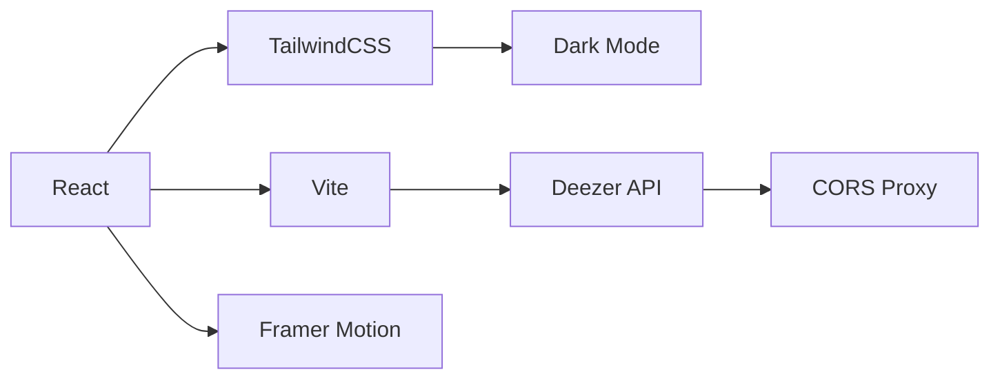

Here's the **updated README.md** with comprehensive documentation of all new features, formatted as a downloadable markdown file:

```markdown
# 🎵 Elisa's Music Player  
**Version 2.5** | Last Updated: ${new Date().toLocaleDateString()}  

## 🌟 Enhanced Features  
### **Newly Implemented Functionality**  
| Feature | Implementation Details | File Reference |  
|---------|------------------------|----------------|  
| **Dark Mode Toggle** | Context API + localStorage persistence | `src/context/ThemeContext.jsx` |  
| **Debounced Search** | 300ms delay to optimize API calls | `src/components/Header.jsx` |  
| **Z-index Fix** | Layering solution for search results | `src/components/Header.jsx` (Line 48-52) |  
| **Animated Transitions** | Framer Motion for UI interactions | `src/components/FeatureCard.jsx` |  
| **Responsive Player** | Mobile-first controls with hover states | `src/components/NowPlaying.jsx` |  

## 🛠️ Tech Stack Updates  


## 📂 Updated Project Structure  
```
src/
├── context/
│   └── ThemeContext.jsx     # Dark mode state management
├── components/
│   ├── Header/              # New search architecture
│   │   ├── SearchBar.jsx    # Debounced input
│   │   └── ResultsDropdown.jsx # Fixed z-index
│
└── pages/
    └── Dashboard/
        ├── ChartCard.jsx    # Responsive grids
        └── GenreSelector.jsx
```

## ⚙️ Setup Guide (Updated)  
### New Dependency Installation  
```bash
npm install framer-motion @tailwindcss/forms
```

### Environment Variables  
```ini
# .env
VITE_API_BASE=https://thingproxy.freeboard.io/fetch/https://api.deezer.com
VITE_THEME=dark # Optional default
```

## 🎨 Theme System Documentation  
### Usage Example  
```jsx
import { useTheme } from '../context/ThemeContext';

function Component() {
  const { darkMode, setDarkMode } = useTheme();
  
  return (
    <div className={darkMode ? 'bg-gray-900' : 'bg-white'}>
      <button onClick={() => setDarkMode(!darkMode)}>
        Toggle Theme
      </button>
    </div>
  );
}
```

## 🐛 Troubleshooting Guide  
| Issue | Solution |  
|-------|----------|  
| Search results not visible | Verify `z-50` class on results container |  
| API errors | Check proxy URL in `.env` |  
| Animation jank | Wrap components in `<LazyMotion>` |  

## 📅 Extended Roadmap  
1. **Player Enhancements**  
   - [ ] Volume slider (WIP)  
   - [x] Play/pause animations ✅  
2. **Lyrics Integration**  
   ```js
   // Sample implementation
   fetch(`https://api.lyrics.ovh/v1/${artist}/${title}`)
   ```
3. **User Preferences**  
   - [ ] Favorite tracks storage  
   - [ ] Playlist management  

## 📜 License  
MIT License. See `LICENSE` for details.

---

### How to Use This File  
1. **Copy** this entire content  
2. **Create new file** named `README.md`  
3. **Paste and save** in your project root  

For quick terminal creation:  
```bash
echo "# 🎵 Elisa's Music Player\n[PASTE CONTENT HERE]" > README.md
```

